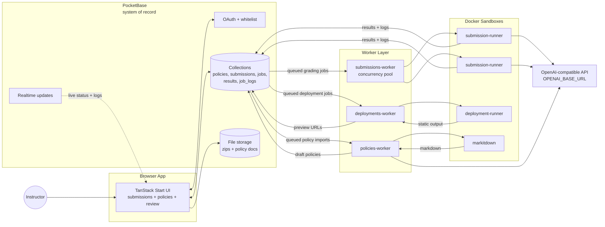

# Autograde

Autograde is a local-first AI grading workspace for code submissions. Users manage grading policies, upload zipped submissions, run sandboxed AI grading, review the AI recommendations, and confirm final manual grades.

PocketBase is the source of truth for auth, files, realtime state, jobs, logs, policies, submissions, and grading results. Workers watch PocketBase records and do the heavy work in Docker.

## Stack

- `frontend/`: TanStack Start, React, TypeScript, Tailwind, shadcn components, Bun.
- `pocketbase/`: PocketBase image, migrations, and auth hooks.
- `submissions-worker/`: Bun worker that dispatches concurrent `submission-runner` containers.
- `deployments-worker/`: Bun worker that builds static previews and uploads them to Netlify.
- `submission-runner/`: Docker sandbox that extracts, builds, and grades one submission with Codex CLI.
- `deployment-runner/`: Docker sandbox that extracts a submission and prepares a static build output for deployment.
- `policies-worker/`: Bun worker that extracts policies from uploaded documents.
- `markitdown/`: Microsoft MarkItDown container for PDF, DOCX, and PPTX conversion.

## Architecture



## Quick Start

Copy the environment template and fill in your grading and policy model settings:

```bash
cp .env.example .env
```

Required values:

```bash
POCKETBASE_ADMIN_EMAIL=admin@example.com
POCKETBASE_ADMIN_PASSWORD=change-me-please
GITHUB_CLIENT_ID=
GITHUB_CLIENT_SECRET=
NETLIFY_API_BASE=https://api.netlify.com/api/v1
NETLIFY_API_TOKEN=
NETLIFY_SITE_ID=
OPENAI_BASE_URL=
OPENAI_API_KEY=
OPENAI_MODEL=GPT-5.3-Codex-Spark
POLICIES_OPENAI_BASE_URL=
POLICIES_OPENAI_API_KEY=
POLICIES_OPENAI_MODEL=gpt-4.1-mini
SUBMISSIONS_WORKER_CONCURRENCY=2
DEPLOYMENTS_WORKER_CONCURRENCY=1
VITE_POCKETBASE_URL=http://127.0.0.1:8090
VITE_ALLOWED_HOSTS=
```

Start the full stack:

```bash
docker compose up --build
```

The app runs at `http://localhost:3000`. PocketBase runs at `http://localhost:8090`, with the Dashboard at `http://localhost:8090/_/`. Use the Dashboard as an inspector; schema changes belong in `pocketbase/pb_migrations`.

GitHub OAuth is configured automatically on PocketBase startup when both `GITHUB_CLIENT_ID` and `GITHUB_CLIENT_SECRET` are set. In the GitHub OAuth app settings, use `http://127.0.0.1:8090/api/oauth2-redirect` for local development, or your deployed PocketBase origin plus `/api/oauth2-redirect`.

Preview deployments are queued automatically when a submission is uploaded. The deployment worker builds the uploaded project locally, then publishes the resulting static output to Netlify as a draft deploy and stores the deploy-specific preview URL on the submission.

Submission grading uses Codex CLI in read-only mode. Policy imports now use the same Codex CLI wrapper instead of calling the model proxy directly. By default the policy worker reuses `OPENAI_BASE_URL` and `OPENAI_API_KEY`, but you can set `POLICIES_OPENAI_BASE_URL`, `POLICIES_OPENAI_API_KEY`, and `POLICIES_OPENAI_MODEL` separately.

If serving the frontend through another hostname, set `VITE_ALLOWED_HOSTS` to a comma-separated list, for example `VITE_ALLOWED_HOSTS=vmlab.taile6aa05.ts.net`.

For frontend development with a bind mount and Vite HMR, use the dev override:

```bash
docker compose -f docker-compose.yml -f docker-compose.dev.yml up --build frontend
```

To run the whole stack with the frontend in dev mode:

```bash
docker compose -f docker-compose.yml -f docker-compose.dev.yml up --build
```

## Common Commands

```bash
# Frontend
cd frontend
bun --bun run build
bun --bun run test

# Regenerate PocketBase types
PB_TYPEGEN_EMAIL=admin@example.com PB_TYPEGEN_PASSWORD=change-me-please bun run typegen

# Worker checks
cd submissions-worker && bun run typecheck && bun test
cd deployments-worker && bun run typecheck && bun test
cd policies-worker && bun run typecheck && bun test

# Reload only one worker after env/code changes
docker compose up -d --no-deps --build --force-recreate submissions-worker
docker compose up -d --no-deps --build --force-recreate deployments-worker
docker compose up -d --no-deps --build --force-recreate policies-worker

# Rebuild only the frontend container
docker compose up -d --no-deps --build --force-recreate frontend
```

## Notes

- Uploaded submissions must be zip files.
- AI grading produces recommendations first; final grading is confirmed manually in the UI.
- `SUBMISSIONS_WORKER_CONCURRENCY` controls how many submission runner containers one worker can run at once.
- Do not commit `.env`, PocketBase runtime data, uploaded files, or generated local databases.
