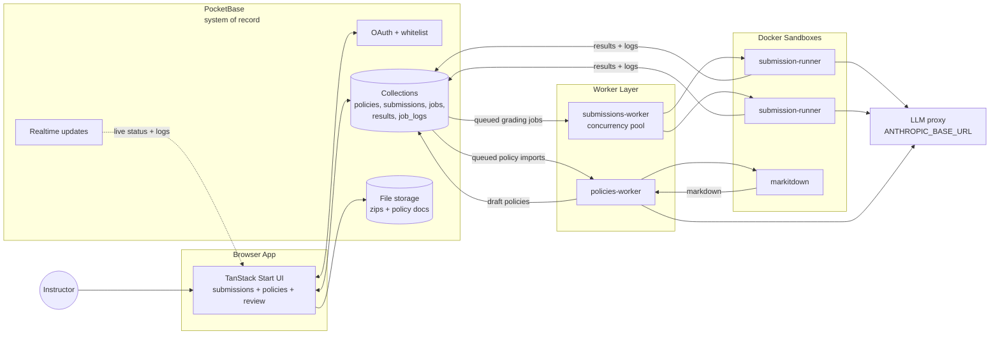

# Autograde

Autograde is a local-first AI grading workspace for code submissions. Users manage grading policies, upload zipped submissions, run sandboxed AI grading, review the AI recommendations, and confirm final manual grades.

PocketBase is the source of truth for auth, files, realtime state, jobs, logs, policies, submissions, and grading results. Workers watch PocketBase records and do the heavy work in Docker.

## Stack

- `frontend/`: TanStack Start, React, TypeScript, Tailwind, shadcn components, Bun.
- `pocketbase/`: PocketBase image, migrations, and auth hooks.
- `submissions-worker/`: Bun worker that dispatches concurrent `submission-runner` containers.
- `submission-runner/`: Docker sandbox that extracts, builds, and grades one submission with Claude Code.
- `policies-worker/`: Bun worker that extracts policies from uploaded documents.
- `markitdown/`: Microsoft MarkItDown container for PDF, DOCX, and PPTX conversion.

## Architecture



## Quick Start

Copy the environment template and fill in your LLM proxy settings:

```bash
cp .env.example .env
```

Required values:

```bash
POCKETBASE_ADMIN_EMAIL=admin@example.com
POCKETBASE_ADMIN_PASSWORD=change-me-please
ANTHROPIC_BASE_URL=
ANTHROPIC_AUTH_TOKEN=
ANTHROPIC_MODEL=
ANTHROPIC_DEFAULT_HAIKU_MODEL=
SUBMISSIONS_WORKER_CONCURRENCY=2
```

Start the backend, workers, and sandbox images:

```bash
docker compose up --build
```

PocketBase runs at `http://localhost:8090`. The Dashboard is available at `http://localhost:8090/_/` and should be used as an inspector; schema changes belong in `pocketbase/pb_migrations`.

Run the frontend separately:

```bash
cd frontend
bun install
bun --bun run dev
```

Open `http://localhost:3000`.

## Common Commands

```bash
# Frontend
cd frontend
bun --bun run build
bun --bun run test

# Regenerate PocketBase types
PB_TYPEGEN_EMAIL=admin@example.com PB_TYPEGEN_PASSWORD=change-me-please bun run typegen

# Worker checks
cd submissions-worker && bun run typecheck && bun test
cd policies-worker && bun run typecheck && bun test

# Reload only one worker after env/code changes
docker compose up -d --no-deps --build --force-recreate submissions-worker
docker compose up -d --no-deps --build --force-recreate policies-worker
```

## Notes

- Uploaded submissions must be zip files.
- AI grading produces recommendations first; final grading is confirmed manually in the UI.
- `SUBMISSIONS_WORKER_CONCURRENCY` controls how many submission runner containers one worker can run at once.
- Do not commit `.env`, PocketBase runtime data, uploaded files, or generated local databases.
